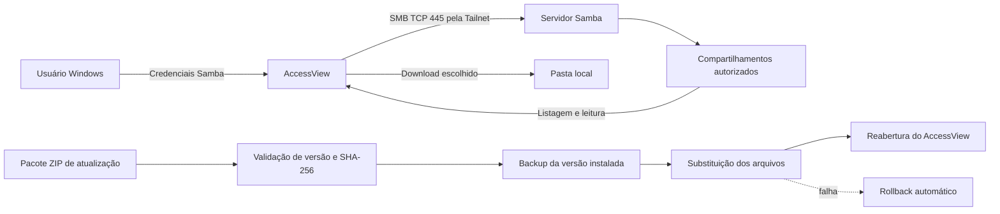
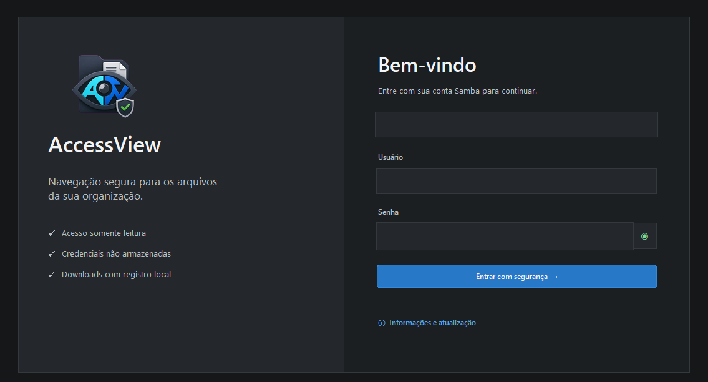
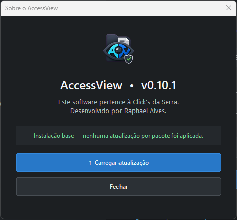
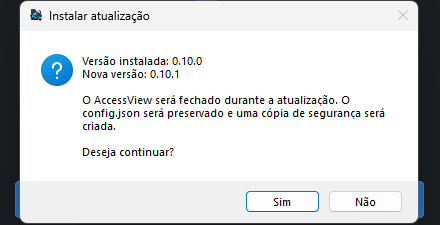

<p align="center">
  
</p>

<p align="center">
  
  
  
  
  
  
</p>

<p align="center">
  Navegador desktop seguro e somente leitura para compartilhamentos Samba
  acessados por uma Tailnet.
</p>

> Software pertencente à Click's da Serra. Desenvolvido por Raphael Alves.

## Visão geral

O AccessView simplifica a consulta e o download de arquivos corporativos sem
mapear unidades de rede, salvar credenciais ou disponibilizar funções de
alteração e exclusão.

Ele cria uma sessão SMB própria, conecta diretamente ao servidor configurado
e apresenta os compartilhamentos em uma interface desktop moderna para
Windows.

## Regra central

```text
O AccessView apenas visualiza e baixa arquivos.

Permissões reais continuam sendo controladas pelo Samba e pela Tailnet.
```

## Arquitetura



## Casos de uso

- consulta de arquivos em servidores internos;
- acesso administrativo a backups;
- navegação em acervos fotográficos;
- download controlado por supervisores;
- terminais Windows conectados por Tailscale;
- ambientes que precisam ocultar operações de escrita do usuário final.

## Recursos

### Navegação

- árvore lateral carregada sob demanda;
- caminho atual destacado em verde;
- ramificações fora de uso recolhidas automaticamente;
- botão Home e navegação para a pasta anterior;
- modos de miniaturas e detalhes;
- miniaturas reais de imagens;
- seleção múltipla com `Ctrl` e `Shift`.

### Segurança

- operação estritamente somente leitura;
- credenciais mantidas apenas durante a sessão;
- senha oculta por padrão, com controle de visualização;
- sessão SMB encerrada no logout;
- `config.json` local e ignorado pelo Git;
- logs sem registro da senha;
- nenhuma unidade de rede é mapeada no Windows.

### Download

- download individual ou em lote;
- progresso por bytes transferidos;
- nomes duplicados preservados com sufixo automático;
- auditoria local de início, sucesso e falha.

### Atualização

- pacote ZIP sem reinstalação;
- validação de aplicativo, versão e SHA-256;
- elevação administrativa somente no atualizador;
- backup automático;
- rollback em caso de erro;
- preservação obrigatória do `config.json`;
- bloqueio de pacote antigo ou já instalado.

## Interface

### Login seguro



### Informações e atualização

<p align="center">
  
</p>

### Confirmação da atualização

<p align="center">
  
</p>

## Estrutura do projeto

```text
AccessView/
├── app.py                         interface e cliente SMB
├── updater.py                     atualizador externo
├── create_update_package.py       criação e hashes do pacote ZIP
├── AccessView.iss                 instalador Inno Setup
├── AccessView.ico                 ícone do Windows
├── AccessView.png                 logo da interface
├── config.example.json            configuração sem dados reais
├── BUILD-RELEASE.bat              build completo
├── GERAR-ATUALIZACAO.bat          build de atualização
├── docs/                          documentação e imagens
├── tests/                         testes automatizados
└── .github/                       CI, build e templates
```

## Requisitos

### Para executar

- Windows 10 ou Windows 11;
- Tailnet ativa;
- acesso TCP à porta 445 do servidor;
- conta Samba autorizada.

### Para desenvolver e compilar

- Python 3.11 ou superior;
- Inno Setup 6 para gerar o instalador;
- dependências de `requirements.txt`.

## Início rápido

Clone o repositório:

```powershell
git clone https://github.com/raphaelalves-dev/AccessView.git
cd AccessView
```

Crie a configuração local:

```powershell
copy config.example.json config.json
```

Exemplo:

```json
{
  "server_ip": "100.100.100.100",
  "shares": ["BACKUP-2026", "SERVER-FILES"],
  "display_name": "Example Server",
  "port": 445,
  "connection_timeout": 8,
  "skip_dfs": true,
  "auth_protocol": "ntlm"
}
```

Prepare e execute:

```text
PREPARAR-AMBIENTE.bat
EXECUTAR.bat
```

## Gerar os executáveis

```text
build_exe.bat
```

Resultado:

```text
dist\AccessView\AccessView.exe
dist\AccessView\AccessViewUpdater.exe
```

## Gerar a release completa

Opcionalmente defina a senha do instalador apenas na sessão local:

```powershell
$env:ACCESSVIEW_INSTALLER_PASSWORD = "uma-senha-nova-e-forte"
```

Execute:

```text
BUILD-RELEASE.bat
```

Resultados:

```text
output\AccessView-Setup-v0.10.1.exe
output\AccessView-Update-v0.10.1.zip
```

Sem a variável de ambiente, o instalador é gerado sem senha.

## Gerar atualizações futuras

1. aumente `APP_VERSION` no `app.py`;
2. atualize os metadados do instalador quando necessário;
3. execute `GERAR-ATUALIZACAO.bat`.

```text
ATUALIZACOES\vX.Y.Z\AccessView-Update-vX.Y.Z.zip
```

Consulte o [guia de atualização](docs/UPDATE_GUIDE.md).

## Logs

Aplicativo:

```text
C:\ProgramData\AccessView\logs
```

Atualizador:

```text
C:\ProgramData\AccessView\updates
```

## Segurança e publicação

Não publique:

```text
config.json
IPs reais da Tailnet
nomes internos de servidores
credenciais
logs de produção
senhas do instalador
pacotes privados de atualização
```

Use arquivos `.example` e placeholders. Consulte [SECURITY.md](SECURITY.md).

## Status do projeto

Versão atual: **0.10.1**

O projeto está funcional e em evolução. Teste novas builds e pacotes de
atualização em um terminal sem dados críticos antes da distribuição em
produção.

## Documentação

- [Guia de atualização](docs/UPDATE_GUIDE.md)
- [Publicação no GitHub](docs/GITHUB_PUBLISH.md)
- [Histórico de versões](CHANGELOG.md)
- [Política de segurança](SECURITY.md)
- [Contribuição](CONTRIBUTING.md)

## Licença

Código-fonte proprietário da Click's da Serra. Consulte [LICENSE.md](LICENSE.md).
